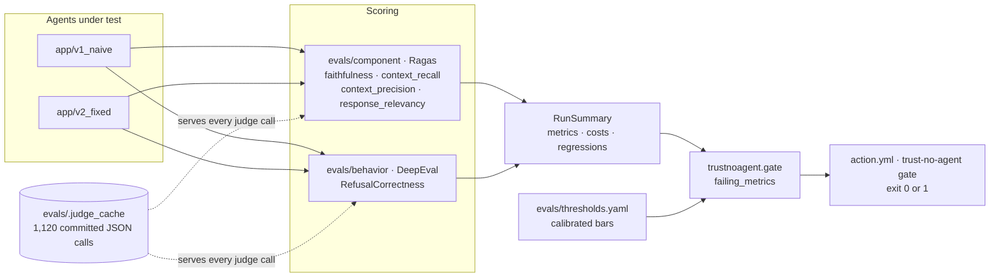

# trust-no-agent

**An LLM agent can produce output that reads as correct and still be measurably broken. This harness proves it — offline, with no API key, for $0.00.**

[](https://pypi.org/project/trust-no-agent/)
[](https://pypi.org/project/trust-no-agent/)
[](https://github.com/darshan-panchal1/trust-no-agent/blob/main/LICENSE)
[](https://github.com/darshan-panchal1/trust-no-agent/actions/workflows/offline.yml)

<!-- DEMO GIF: not yet recorded. Drop the file at docs/demo.gif and replace this comment with:
     
     Absolute raw URL, not a relative path — this README is also the PyPI long description. -->

Two variants of the same document-QA agent ship here. They are indistinguishable by reading
their answers — both are fluent, confident and well written. One of them is measurably
wrong, and the point of this repository is that you cannot tell which without the harness.

## 🔥 Features

- **Two agents, one corpus, one model** — `v1_naive` and `v2_fixed` differ on three
  deliberate axes; their prose is equally convincing and their scores are not.
- **Offline by default** — 1,120 committed judge-cache entries under `evals/.judge_cache/`.
  No API key, no network, `$0.00` on every run, 100% cache hit rate.
- **Calibrated bars, not guessed constants** — every threshold in `evals/thresholds.yaml` is
  the midpoint of real v1/v2 scored runs, with the observed values recorded beside it.
- **Ragas and DeepEval under one gate** — component metrics and behavioral checks resolve to
  a single `RunSummary` and a single pass/fail answer.
- **Three ways in** — a GitHub Action, a `trust-no-agent gate` CLI, and an `EvalSuite`
  library API, all over the same code path.
- **The harness distrusts itself** — `tests/test_harness_integrity.py` reproduces a real
  score-laundering bug this harness once had, so the failure mode stays proven, not assumed.

> [!IMPORTANT]
> The **GitHub Action is the intended integration path.** It runs the same offline, keyless,
> `$0.00` gate this repo runs on itself and fails your build when a calibrated bar breaks —
> no credential to provision, nothing to configure. See
> [GitHub Action](#github-action) below.

## Quickstart

```
git clone <repo> && cd trust-no-agent && uv sync && uv run pytest
```

That is the whole thing. No API key, no configuration, no network — every judge call is
served from committed evidence, and the run ends with a cost table. Real output:

```
call_kind                     calls  cached    tok_in   tok_out         USD
---------------------------------------------------------------------------
deepeval:refusalcorrectness      30      30    13,037     8,603       $0.00
generate:v1_naive                32      32     5,721     8,343       $0.00
generate:v2_fixed                32      32    26,345     5,592       $0.00
ragas:context_precision         350     350         0         0       $0.00
ragas:context_recall            100     100         0         0       $0.00
ragas:embeddings                200     200         0         0       $0.00
ragas:faithfulness              200     200         0         0       $0.00
ragas:response_relevancy        100     100         0         0       $0.00
---------------------------------------------------------------------------
TOTAL                          1044    1044    45,103    22,538       $0.00
cache hit rate: 100%   spend this run: $0.00
129 passed, 2 skipped, 3 xfailed, 22 warnings in 2.12s
```

The `3 xfailed` are the point, not a bug: that is `v1_naive` measured against the real
calibrated thresholds in `tests/test_separation_contract.py` and missing every one. It is
marked expected because v1 is never fixed.

### As a library

```
pip install trust-no-agent
```

```python
from trustnoagent import EvalSuite

suite = EvalSuite(
    judge_model="nvidia/nemotron-3-super-120b-a12b",
    generator_model="nvidia/nemotron-3-super-120b-a12b",
)
summary = suite.run()

print(summary.metrics)
print(suite.gate(summary))
```

Real output — `suite.run()` returns a `RunSummary`, and `suite.gate()` returns the gated
metrics that missed their bar, so an empty list means every gate held:

```
[MetricRow(metric='faithfulness', v1_mean=0.7324761904761905, v2_mean=0.8736969696969697, threshold=0.8030865800865801), MetricRow(metric='context_recall', v1_mean=0.56, v2_mean=0.88, threshold=0.72), MetricRow(metric='context_precision', v1_mean=0.639999999936, v2_mean=0.7978333332649875, threshold=None), MetricRow(metric='response_relevancy', v1_mean=0.6615704720745859, v2_mean=0.7539915682525976, threshold=None), MetricRow(metric='RefusalCorrectness', v1_mean=0.8, v2_mean=1.0, threshold=0.9)]
[]
```

`threshold=None` marks a diagnostic metric — scored and reported, but never gating. The same
run is available from the command line as `trust-no-agent gate <judge-model> <generator-model>`,
which exits non-zero on a miss.

## GitHub Action

```yaml
name: evals

on: pull_request

jobs:
  gate:
    runs-on: ubuntu-latest
    steps:
      - uses: actions/checkout@v4

      - uses: darshan-panchal1/trust-no-agent@v1
        with:
          judge-model: nvidia/nemotron-3-super-120b-a12b
          generator-model: nvidia/nemotron-3-super-120b-a12b
```

Both inputs are required and have no defaults — a model identifier that isn't in the
committed evidence is a cache miss, not a silent fallback. The step fails when a gated metric
misses its calibrated bar. This repo dogfoods the same action on its own pull requests in
[`.github/workflows/example.yml`](https://github.com/darshan-panchal1/trust-no-agent/blob/main/.github/workflows/example.yml).

## Architecture



## Results

Every number below is a measured mean over the committed evidence, not an illustration. The
bar is the midpoint between the two observed values; `Δ` is `v2 − v1`.

| Metric | `v1_naive` | `v2_fixed` | Δ | Calibrated bar | Gates? |
|---|---|---|---|---|---|
| `faithfulness` | 0.7325 | 0.8737 | +0.1412 | 0.8031 | ✅ separates |
| `context_recall` | 0.5600 | 0.8800 | +0.3200 | 0.7200 | ✅ separates |
| `RefusalCorrectness` | 0.8000 | 1.0000 | +0.2000 | 0.9000 | ✅ separates |
| `context_precision` | 0.6400 | 0.7978 | +0.1578 | — | diagnostic only |
| `response_relevancy` | 0.6616 | 0.7540 | +0.0924 | — | diagnostic only |

Regression comparisons use a tolerance of `0.15`, derived from the largest same-run noise
spread actually measured (`faithfulness`, n=4, spread 0.0947, stdev 0.0434) and rounded up —
so a "regression" has to clear the harness's own measured noise floor before it is called one.

`ToolCorrectness` is deliberately ungated: a green tool-correctness number is a statement
about how the metric was configured, not about the agent.

## 🔍 Telemetry

Ragas and DeepEval both phone home by default. This repo turns all three opt-outs on before
either library is imported:

| Variable | Value | Silences |
|---|---|---|
| `DEEPEVAL_TELEMETRY_OPT_OUT` | `YES` | DeepEval's PostHog upload |
| `RAGAS_DO_NOT_TRACK` | `true` | Ragas' analytics |
| `DEEPEVAL_DISABLE_DOTENV` | `1` | DeepEval's implicit `.env` read |

They are set in **`pyproject.toml`'s `[tool.pytest.ini_options] env` block** (so every
`uv run pytest` is covered) and in **`action.yml`** (so the packaged GitHub Action is
covered). `tests/test_offline_guarantees.py` asserts all three are live, and they are set in
the pytest ini rather than `conftest.py` on purpose — a `conftest.py` assignment can run
*after* the import that reads the variable, which looks correct and does nothing.

> [!NOTE]
> These are **not** set by the library or the console script on your behalf. If you call
> `EvalSuite` or run `trust-no-agent gate` outside pytest and outside the Action, export them
> yourself — otherwise DeepEval's telemetry will attempt an upload from your process:
> ```
> export DEEPEVAL_TELEMETRY_OPT_OUT=YES RAGAS_DO_NOT_TRACK=true DEEPEVAL_DISABLE_DOTENV=1
> ```

## What you are looking at

| | |
|---|---|
| `app/v1_naive` · `app/v2_fixed` | the two variants — same corpus, same model, three deliberate differences |
| `evals/component/` | Ragas metrics — *why* is it bad? (scalar diagnostics) |
| `evals/behavior/` | DeepEval checks — pass/fail verdicts, but scored against GEval's library default (`threshold=0.5`), not the calibrated bars |
| `evals/thresholds.yaml` | the real gate: thresholds calibrated from v1/v2's actual scored runs |
| `tests/test_separation_contract.py` | the only test that reads the calibrated thresholds — v1 must miss every bar, v2 must clear all three |
| `evals/.judge_cache/` | the committed evidence, one reviewable JSON per call |
| `tests/test_harness_integrity.py` | proof the harness itself can lie, and does |
| `docs/attribution.md` | which of the three deliberate differences each separating metric is attributed to |

[CONSTITUTION.md](https://github.com/darshan-panchal1/trust-no-agent/blob/main/CONSTITUTION.md)
is binding, not aspirational — read it before changing anything.
[docs/api-notes.md](https://github.com/darshan-panchal1/trust-no-agent/blob/main/docs/api-notes.md)
records what the pinned libraries actually do, as opposed to what their documentation claims;
several entries fail silently.

## Maintaining this repo

Everything below is for maintainers. A viewer never needs any of it — `pytest` stays the
only command required to see the result.

```
uv run python -m evals.cli --help     # record · calibrate · compare · report · gate
uv run ruff check . && uv run mypy .  # lint and types
```

A local `record` run only writes cache entries — it is billed, and it is the CLI's one
command that reads a provider credential, but it does not open a pull request itself. In
CI (`.github/workflows/live.yml`), `record` runs and is then followed by `gh pr create`, so
the evidence arrives as a reviewable diff. Outside the CLI, two other scripts also write
evidence under their own credential reads — `app/smoke_check.py` and
`evals/ops/regression_demo.py` — both run by hand, never by CI. Across all of them the
single-writer guarantee holds repo-wide (`tests/test_one_door.py` enforces it): every write
goes through one sanctioned path, `record` just isn't the only caller of it.

Live scoring needs two independent opt-ins together — the `live` marker *and* `EVAL_LIVE=1`.
Either alone skips, on purpose: one switch has too many plausible accidental causes, and the
failure mode is spending money you did not mean to spend.

Releases publish to PyPI through
[`.github/workflows/publish.yml`](https://github.com/darshan-panchal1/trust-no-agent/blob/main/.github/workflows/publish.yml)
via OIDC trusted publishing — manually dispatched, and there is no PyPI token stored anywhere
in this repository.

## Contributing

There is no `CONTRIBUTING.md`, and that is deliberate: the contribution rules are the
constitution. Read
[CONSTITUTION.md](https://github.com/darshan-panchal1/trust-no-agent/blob/main/CONSTITUTION.md)
first — it is binding, code that violates an article is rejected even when it works, and
Article 0 (cold clone, offline, no key, `$0.00`) outranks everything else. Amendments happen
in the open, with a dated verification; they are never made silently.

## License

MIT — see [LICENSE](https://github.com/darshan-panchal1/trust-no-agent/blob/main/LICENSE).

## Video

A walkthrough recording is planned — link to be added here once it is published.
